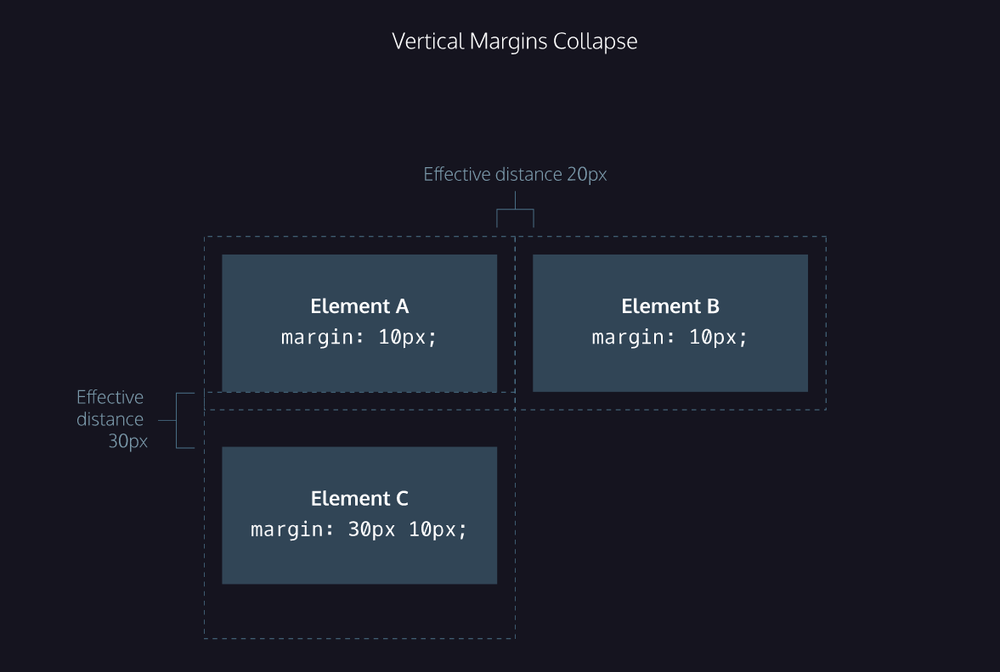

[BACK TO FULL COURSE DESCRIPTION](https://github.com/Andre-Arante/introtowebdesign)

# Week 4 - CSS Layout: The Box Model

- [Div Containers](#div-containers)
- [The Box Model](#the-box-model)
- [width and height](#width-and-height)
- [border](#border)
- [padding](#padding)
- [margin](#margin)
- [Centering Content](#centering-content)

# Div Containers

This is the conventional way to group elements together. This way you can edit multiple elements as one group

```
In HTML
<div class='container'>
    <h1>Title</h1>
    <p>Content</p>
</div>

IN CSS
.container { ... }
```

# The Box Model


# `width` and `height`

- note that this only affects the dimensions of the content area

```
p {
    width: 100px;
    height: 150px;
}
```

# `border`

- the thickness and style of the border surronding the content and padding

border: width <a href="https://developer.mozilla.org/en-US/docs/Web/CSS/border-style#values">style</a> <a href="https://developer.mozilla.org/en-US/docs/Web/CSS/color_value">color</a>;

```
p {
    border: 3px solid coral;
}
```

## Border Radius

Sets each corner of the box to have a radius of 5px

`border-radius: 5px;`

Creates a perfect circle

`border-radius: 50%; `

# `padding`

- the amount of space between the border and the content
- useful for making things less cramped

`padding: 20px;`

- gives all sides padding of 20px

`padding-top: 5px;`

- you can also specify specific sides

# `margin`

- amount of space between element out the outer border

Defined using the same syntax as the padding

## Units

You can use px (pixels) or em (we will learn more about this later)

# Centering Content

```
div.headline {
width: 400px;
margin: 0 auto;
}
```

In order to set the margin to auto, the width must be specified. This is because the default width will take up the entire container space.
Therefore there will be no space for a margin.

# Margin Collapse

Only the vertical margins (top and botom) collapse

For horizontal margins (left and right) the space is equal to the sum of the two margins

```
#element-a {
  margin-right: 10px;

  margin-bottom: 10px;
}

#element-b {
  margin-left: 10px;
}

#element-c {
    margin-top: 30px;
}
```


